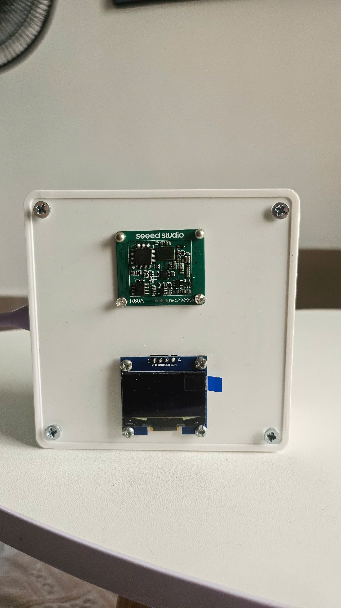
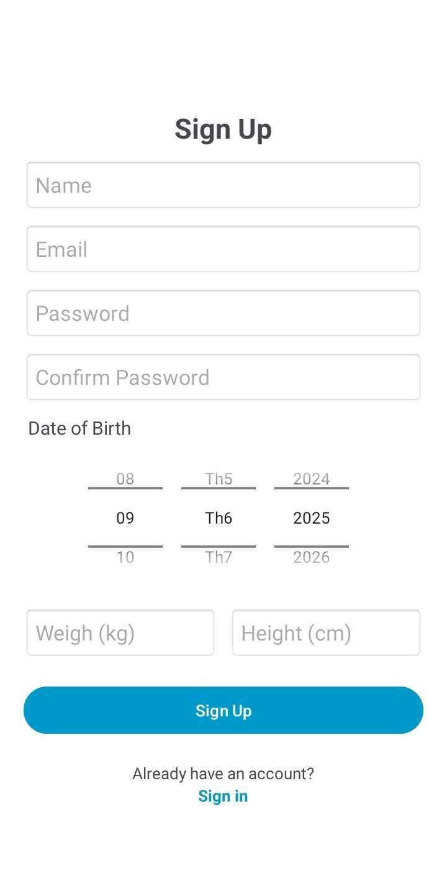
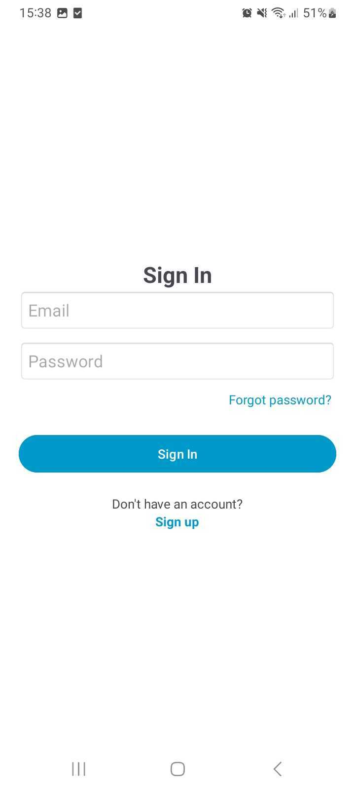
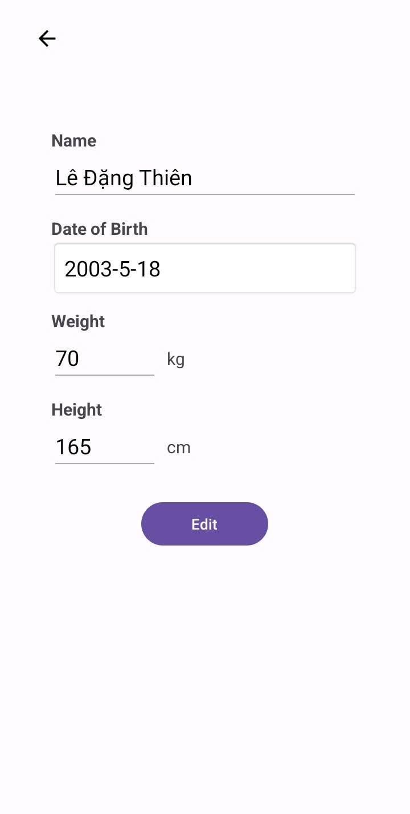
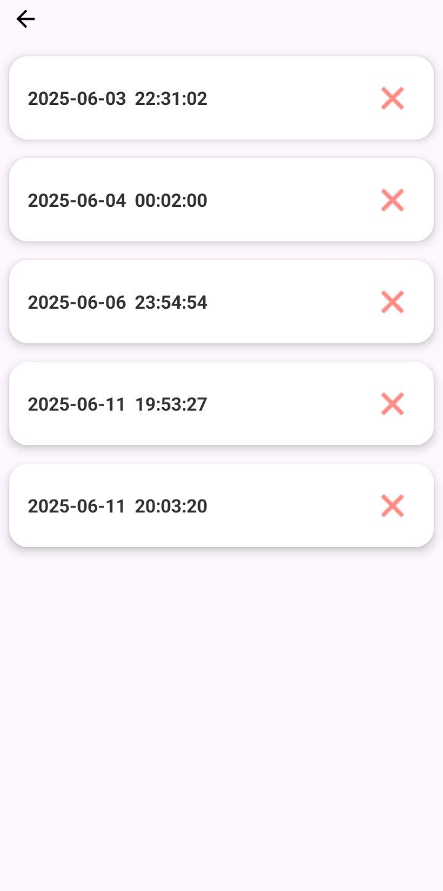
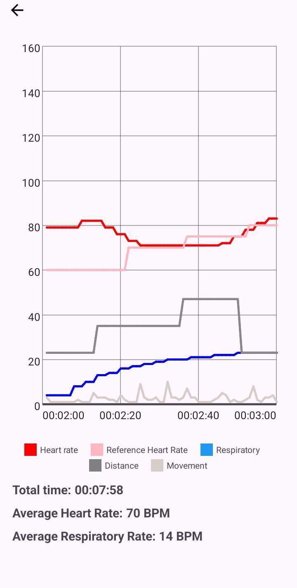
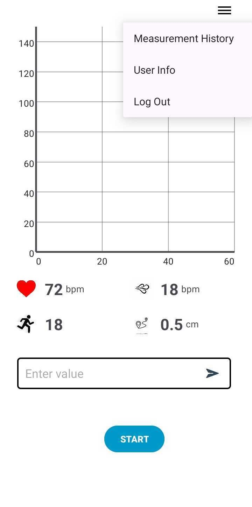

# Contactless Heart Rate Monitoring System

This project focuses on researching, designing, and evaluating the effectiveness of a contactless heart rate monitoring solution using the 60 GHz MR60BHA1 radar sensor, integrated with an ESP32 microcontroller and an Android application, with data storage on Firebase Realtime Database.

---

## 1. Hardware

- **Central Microcontroller**: ESP32  
- **Research Device**: MR60BHA1 60 GHz contactless heart rate radar sensor  
- **Display**: 0.96″ OLED screen  
- **Reference Heart Rate Monitor**: Contec CMS50D1 fingertip pulse oximeter  

---

## 2. Software

### Android Application: “Heart Rate Monitoring”

The Android app is organized into multiple Activities, each corresponding to a specific feature:

- **SignUpActivity**  
  - Registers new users with the following information:  
    - Email  
    - Password  
    - Name  
    - Age  
    - Weight  
    - Height  

- **SignInActivity**  
  - User login functionality.  

- **UserInfoActivity**  
  - View and edit personal information (name, age, weight, height).  

- **MeasurementOptionActivity**  
  - View the history of measurement sessions. Each session is listed by its start timestamp in the format `YYYY_MM_DD HH:mm:ss`.  
  - Users can delete unwanted sessions.
  

- **MeasurementHistoryActivity**  
  - View detailed charts of raw or corrected data for each session.
  

- **HeartRateActivity**  
  - Real‑time heart rate measurement screen.  
  - Manages the overall measurement workflow for the application.
  

---

> **Note:** Data collected by the ESP32 and MR60BHA1 sensor is sent to Firebase Realtime Database for storage and can be visualized in the Android app.
